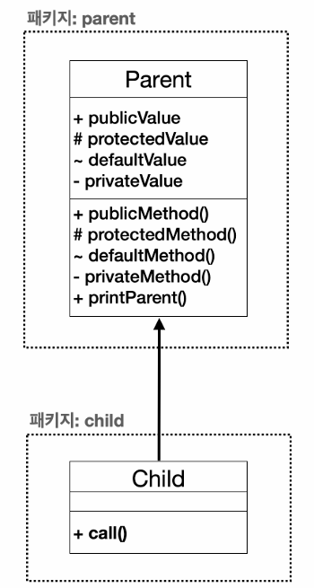
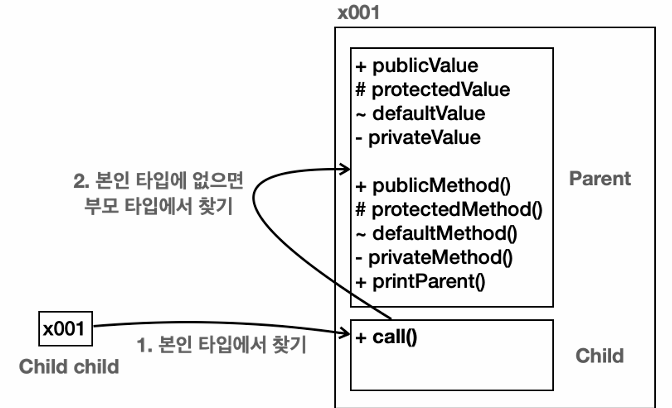

- 접근 제어자를 표현하기 위해 UML 표기법을 일부 사용했다.

`+` : public
`#` : protected
`~` : default
`-` : private

**접근 제어자 종류**
- `private` : 모든 외부 호출을 막는다. 
- `default` : 같은 패키지안에서 호출은 허용한다. 
- `protected` : 같은 패키지 안에서 호출은 허용, 패키지가 달라도 상속 관계의 호출은 허용 
- `public` : 모든 외부 호출을 허용한다. 

**순서**  
`private (가장 많이 차단) -> default -> protected -> public (가장 많이 허용)`

## 접근 제어와 메모리 구조 
  

- 지금 Child 타입이니까 먼저 본인 타입부터 찾고 본인 타입이 없으면 부모 타입에서 기능을 찾는데, 이때 접근 제어자가 영향을 준다.  
- 왜냐하면 객체 내부에서는 자식과 부모가 구분되어 있기 때문이다.  
- 결국 자식 타입에서 부모 타입의 기능을 호출할 때 부모 입장에서 보면 외부에서 호출한 것과 같다. 