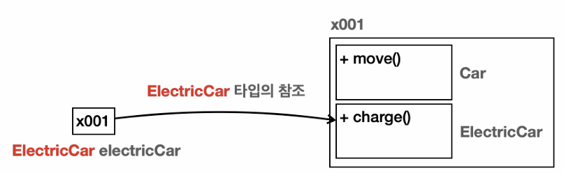
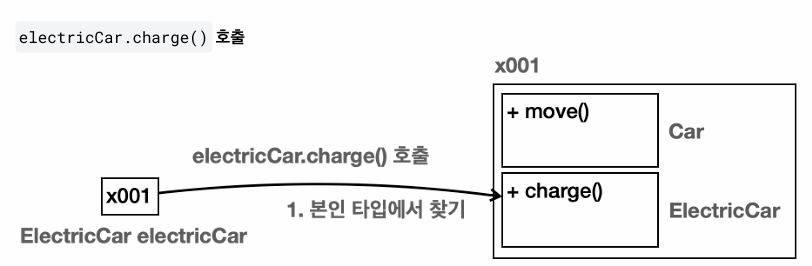
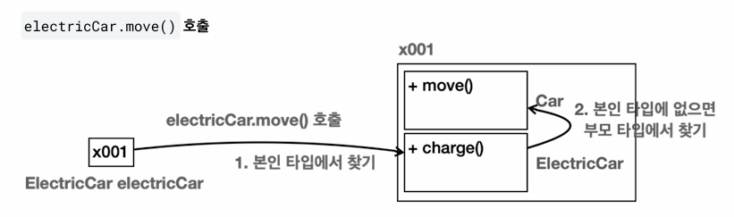

## 상속과 메모리 구조
`**이 부분을 제대로 이해하는 것이 앞으로 정말정말정말정말정말정말 중요하다‼️‼️‼️**`

**상속 관계를 객체로 생성할 때 메모리 구조를 확인**해보자.

```
ElectricCar electricCar = new ElectricCar();
```


> `new ElectricCar()`를 호출하면 `ElectricCar`뿐만 아니라 상속 관계에 있는 `Car`까지 포함해서 인스턴스를 생성한다.  
참조값은 x001로 하나이지만 실제로 그 안에서는 `Car`, `ElectricCar`라는 두가지 클래스 정보가 공존하는 것임 

> 상속이라고 해서 단순하게 부모의 필드와 메서드만 물려 받는게 아니다.  
상속 관계를 사용하면 부모 클래스도 함께 포함해서 생성된다.  
외부에서 볼 때는 하나의 인스턴스를 생성하는 것 같지만 내부에서는 부모와 자식이 모두 생성되고 공간도 구분된다. 

- - -
`electricCar.charge()`호출 



> `electricCar.charge()`를 호출하면 참조값을 확인하기 위해 x001.charge()를 호출한다.  
    따라서 x001을 찾아서 charge()를 호출하면 되는 것이다.  
> 그런데 상속 관계의 경우에는 내부에 부모와 자식이 존재한다.  
    이때 부모인 Car를 통해서 charge()를 찾을지 아니면 ElectricCar를 통해서 charge()를 찾을지 선택해야 한다.  
> 이때는 **호출하는 변수의 타입(클래스)을 기준으로 선택** 한다.
    electricCar이므로 인스턴스 내부에 같은 타입인 ElectricCar를 통해서 charge()를 호출한다.

- - -
`electricCar.move()`호출



> `electricCar.move()`를 호출하면 먼저 x001 참조로 이동한다.  
    내부에는 `Car`, `ElectricCar` 두가지 타입이 있다.  
    이때 호출하는 변수인 `electricCar`의 타입이 `ElectricCar`이므로 이 타입을 선택한다.  
> 그런데 `ElectricCar`에는 `move()`메서드가 없다.  
    상속 관계에서는 자식 타입에 해당하는 기능이 없으면 부모 타입으로 올라가서 찾는다.  
    이 경우 `ElectricCar`의 부모인 `Car`로 올라가서 `move()`를 찾는다.  
    부모인 `Car`에 `move()`가 있으므로 부모에 있는 `move()`메서드를 호출한다.  

>  만약 부모에서도 해당 기능을 찾지 못하면 더 상위 부모에서 필요한 기능을 찾아본다.  
    부모에 부모로 계속 올라가면서 필드나 메서드를 찾는 것이다. 물론 계속 찾아도 없으면 컴파일 오류 발생함  

### 지금까지 설명한 상속과 메모리 구조는 반드시 이해해야함 ️️️‼️️‼️  
1. 상속 관계의 객체를 생성하면 그 내부에는 부모와 자식이 모두 생성된다.  
2. 상속 관계의 객체를 호출할 때, 대상 타입을 정해야 한다. 이때 호출자의 타입을 통해 대상 타입을 찾는다.  
3. 현재 타입에서 기능을 찾지 못하면 상위 부모 타입으로 기능을 찾아서 실행한다. 기능을 찾지 못하면 컴파일 오류 발생 