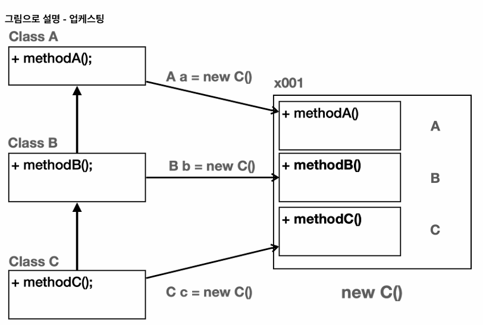
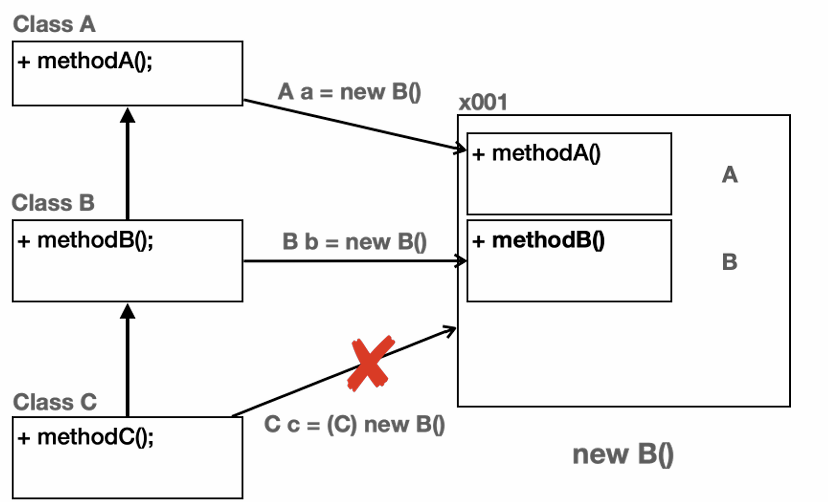

- 객체지향 프로그래밍의 대표적인 특징으로는 캡슐화, 상속, 다형성이 있다.  
- 그 중에서 다형성은 객체지향 프로그래밍의 꽃이라 불린다.   
- 앞서 학습한 캡슐화나 상속은 직관적으로 이해하기 쉽다. 반면에 다형성은 제대로 이해하기도 어렵고 잘 활용하기는 더 어렵다.   
- 하지만 좋은 개발자가 되기 위해서는 다혀성에 대한 이해가 필수야!!   

- 다형성(Polymorphism)은 이름 그대로 다양한 형태, 여러 형태를 뜻한다.   
- 프로그래밍에서 다형성은 한 객체가 여러 타입의 객체로 취급될 수 있는 능력을 뜻한다.   
- 보통 하나의 객체는 하나의 타입으로 고정되어 있다.   
- 근데 다형성을 사용하면 하나의 객체가 다른 타입으로 사용될 수 있다는 뜻이다.   

- 다형성을 이해하기 위해서는 크게 2가지 핵심 이론을 알아야함  
1. 다형적 참조  
2. 메서드 오버라이딩   

**업캐스팅이 안전하고 다운캐스팅이 위험한 이유**  
> 업캐스팅의 경우 이런 문제(CastingMain4() 클래스 코드)가 절대로 발생하지 않는다. 왜냐하면 객체를 생성하면 해당 타입의 상위 부모 타입은 모두 함께 생성된다!  
> 따라서 위로만 타입을 변경하는 업캐스팅은 메모리 상에 인스턴스가 모두 존재하기 때문에 항상 안전하다.   
> 따라서 캐스팅을 생략할 수 있다.   

> 반면에 다운 캐스팅의 경우 인스턴스에 존재하지 않는 하위 타입으로 캐스팅하는 문제가 발생할 수 있다.  
> 왜냐하면 객체를 생성하면 부모 타입은 모두 함께 생성되지 않는다.  
> 따라서 개발자가 이런 문제를 인지하고 사용해야 한다는 의미로 명시적으로 캐스팅을 해주어야 한다.   

**업캐스팅**  
 
  

> 클래스 A, B, C는 상속 관계다.  
> new C()로 인스턴스를 생성하면 인스턴스 내부에 자신과 부모인 A, B, C가 모두 생성된다. 따라서 부모 타입인 A,B, C 모두   
> C 인스턴스를 참조할 수 있다.   
> 상위로 올라가는 업캐스팅은 인스턴스 내부에 부모가 모두 생성되기 때문에 문제가 발생하지 않는다.   

> A a = new C(); : A로 업캐스팅    
> B b = new C(); : B로 업캐스팅   
> C c = new C(); : 자신과 같은 타입  

  

> new B()로 인스턴스를 생성하면 인스턴스 내부에 자신과 부모인 A, B가 생성된다.  
> 따라서 B의 부모 타입인 A,B 모두 B인스턴스를 참조할 수 있다.   
> 상위로 올라가는 업캐스팅은 인스턴스 내부에 부모가 모두 생성되기 떄문에 문제가 발생하지 않는다.   
> 하지만 객체를 생성할 때 하위 자식은 생성되지 않기 때문에 하위로 내려가는 다운캐스팅은 인스턴스 내부에 없는 부분을 선택하는 문제가 발생할 수 있다.  

> A a = new B(); : A로 업캐스팅    
> B b = new B(); : 자신과 같은 타입   
> C c = new B(); : 하위 타입은 대입할 수 없음, 컴파일 오류   
> C c = (C) new B();  : 하위 타입으로 강제 다운캐스팅, 하지만 B인스턴스에 C와 관련된 부분이 없으므로 잘못된 캐스팅, ClassCastException 런타임 오류 발생   

**컴파일 오류 VS 런타임 오류**  
컴파일 오류는 변수명 오타, 잘못된 클래스 이름 사용 등 자바 프로그램을 실행하기 전에 발생하는 오류다.   
이런 오류는 IDE에서 즉시 확인할 수 있기 떄문에 안전하고 좋은 코드다.   
반면에 런타임 오류는 이름 그대로 프로그램이 실행되고 있는 시점에 발생하는 오류다.  
런타임 오류는 매우 안좋은 오류이다. 왜냐하면 보통 고객이 해당 프로그램을 실행하는 도중에 발생하기 떄문이다.   

## 다형성과 메서드 오버라이딩   
> 다형성을 이루는 또 하나의 중요한 핵심 이론은 바로바로 메서드 오버라이딩이다.  
> 메서드 오버라이딩에서 꼭 기억해야 할 점은 **오버라이딩 된 메서드가 항상 우선권을 가진다는 점이다**   
> 그래서 이름도 기존 기능을 덮어 새로운 기능을 재정의한다는 뜻의 오버라이딩이다.   